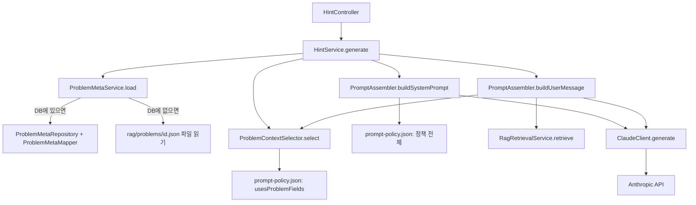

# 코티(Cotea) AI 프롬프트 흐름

> 힌트 요청 하나가 들어왔을 때, 어떤 파일이 어떤 역할로 관여해서 최종적으로 Claude에게 어떤 프롬프트가 전달되는지 정리한 문서.
> 정책의 "내용"(무엇을 허용/금지하는지)은 `backend/src/main/resources/config/prompt-policy.json` 자체를 참고할 것 — 이 문서는 그 정책이 코드상에서 어떻게 조립·전달되는지에 집중한다.

## 전체 흐름

## 구성 요소별 역할

### 1. `prompt-policy.json` — 정책 원본

`backend/src/main/resources/config/prompt-policy.json`. 모든 프롬프트 내용의 유일한 출처. 코드에는 규칙 문구가 하드코딩되어 있지 않고, 전부 이 JSON에서 읽어와 조립한다.

- **`tutorIdentity`**: 튜터의 정체성 한 문장 ("정답이 아닌 방향성을 제시하는 프로그래머스 코딩테스트 전용 AI 튜터...")
- **`coreRules`**: 모든 응답에 공통 적용되는 핵심 규칙 8개 (질문한 것만 답한다, 완성 코드 금지, 메타데이터 그대로 복사 금지 등)
- **`doNotReveal`**: 레벨과 무관하게 절대 노출하면 안 되는 것 목록
- **`hintLevelPolicy.1~4`**: 힌트 레벨별 `allow`/`forbid`/`usesProblemFields`
  - Lv1(관점 힌트): 알고리즘명 절대 금지, `approach.keyInsight` + `classification.difficultyReason`만 사용
  - Lv2(접근 힌트): 알고리즘/자료구조 이름 언급 허용, `classification.primary` + `approach.recommendedApproach`/`alternativeApproaches` 사용
  - Lv3(구현 힌트): 의사코드까지 허용, `implementationCheckpoints`/`stuckPointHints`/`keyDataStructures` 사용
  - Lv4(코드 리뷰/디버깅): 사용자 코드 기반 분석, `commonMistakes`/`fatalApproachSignals` 사용 (userCode 필수)
- **`reasonExplanationPolicy`**: 오답/시간초과 발생 시, 사용자가 "왜?"를 묻기 전(`beforeUserAskReason`)과 후(`afterUserAskReason`)의 서로 다른 행동 지침. `withUserCode`는 사용자 코드가 있을 때 `commonMistakes` 후보 중 실제 코드와 관련된 것만 골라 쓰라는 지침.
- **`bySubmissionResult`**: WRONG_ANSWER/TIME_LIMIT_EXCEEDED/RUNTIME_ERROR별 안내 문구·유도 초점
- **`phasePolicy`**: BEFORE_SOLVE/SOLVING/WRONG_ANSWER/AFTER_SOLVE 단계별 기본 힌트 레벨
- **`responseFormat`**: 톤, 최대 문단 수, 되묻는 질문 포함 여부 등
- **`stuckPointTopicCatalog`**: 문제 메타데이터의 `stuckPointHints`에서 쓸 수 있는 표준 키 9개

`PromptPolicyLoader`가 이 파일을 로드해서 `JsonNode`로 반환한다.

### 2. `ProblemMetaService` / `ProblemMetaMapper` — 문제 메타데이터 조달

`HintService`가 가장 먼저 `problemMetaService.load(problemId)`를 호출해 문제 하나의 전체 메타데이터(JSON)를 가져온다.

- **DB 우선, 파일 폴백**: `ProblemMetaRepository.findById()`로 MySQL에서 먼저 찾고, 없으면 `rag/problems/{id}.json` 파일을 읽는다.
- DB에서 찾은 경우 `ProblemMetaMapper.toJson()`이 `ProblemEntity`(+ 자식 엔티티 13개 테이블)를 파일 버전과 동일한 JSON 트리 모양으로 다시 조립한다 — 그래야 아래 3번 컴포넌트가 소스(DB/파일)를 신경 쓰지 않고 동일하게 동작한다.

### 3. `ProblemContextSelector` — 힌트 레벨별 필드 선택

문제의 전체 메타데이터 중, **지금 이 요청의 힌트 레벨/단계에서 노출해도 되는 필드만** 골라낸다.

- `prompt-policy.json`의 `usesProblemFields`(점(.) 구분 경로 목록, 예: `"wrongAnswerDiagnosis.commonMistakes"`)를 기준으로 필드를 뽑는다.
- `WRONG_ANSWER` 단계에서는 사용자가 "왜 틀렸는지" 질문했는지 여부(`QuestionResolver.userAsksReason`)에 따라 진단 관련 필드를 포함할지 말지 갈린다 — 질문 전이면 진단 필드는 아예 제외.
- `commonMistakes`는 `submissionResult`(WRONG_ANSWER/TIME_LIMIT_EXCEEDED/RUNTIME_ERROR)에 맞는 symptom만 필터링해서 남긴다 (엉뚱한 증상의 오답 원인까지 다 보여주지 않기 위함).

이렇게 걸러진 결과가 "이번 응답에 실제로 쓸 수 있는 문제 메타데이터"다.

### 4. `PromptAssembler` — 실제 프롬프트 문자열 조립

- **`buildSystemPrompt()`**: `tutorIdentity` + `coreRules` + `doNotReveal`을 항상 포함하고, 그 위에 상황별로 달라지는 블록을 얹는다.
  - 오답/시간초과 직후·이유 질문 전이면 "결과만 안내, 진단 정보 금지" 블록만 얹는다 (힌트 레벨 자체를 무시).
  - 그 외에는 해당 힌트 레벨의 `allow`/`forbid` + 현재 stage 설명 + (WRONG_ANSWER면) 오답 진단 정책 + (userCode가 있으면) 코드 진단 지침을 순서대로 붙인다.
- **`buildUserMessage()`**: 문제 제목/레벨/stage/hintLevel을 적고, 2번·3번에서 걸러진 `problemContext`(JSON)를 "참고용, 그대로 복사하지 말 것"이라는 문구와 함께 붙인 뒤, RAG 검색 결과와 사용자 질문을 이어 붙인다.

### 5. `ClaudeClient` — 실제 LLM 호출

`LlmClient` 인터페이스의 구현체. `buildSystemPrompt`/`buildUserMessage` 결과와 대화 히스토리를 받아 Anthropic API(`claude-sonnet-4-6` 기본값)에 실제로 요청을 보내고 응답 텍스트를 반환한다. API 키가 없으면 즉시 에러를 던진다.

### 6. `HintService` — 전체 오케스트레이션

위 컴포넌트들을 순서대로 호출하는 지점. `dryRun: true`로 요청하면 실제 LLM 호출 없이 `systemPrompt`/`userMessage` 조립 결과까지만 반환한다 — 정책 튜닝 시 이 옵션으로 프롬프트만 눈으로 확인할 수 있다.

## 참고

- 힌트 레벨별 기대 응답 품질은 `docs/expected-hints/1829.md`에 QA 체크리스트 형태로 정리되어 있다 (카카오프렌즈 컬러링북 문제 기준).
- DB ↔ 파일 폴백 여부는 `ProblemMetaMapper`가 채우는 `metadata.source` 필드("mysql")로 구분할 수 있다.
