# 코티(Cotea) ERD — 문제 메타데이터 (v0.2)

> 관계형 DB(MySQL/PostgreSQL 등)로 저장한다는 가정 하에 작성. **DB 종류 자체는 팀 확정 필요.**
> RAG 지식 베이스(B) / common_pitfalls는 벡터 DB 대상이라 이 ERD 범위에서 제외 — 별도 문서(벡터DB 스키마 ) 참고.

## 변경 이력

- **v0.2 (2026-07-13)**: `json_to_sql.py`가 이미 생성하고 있었지만 이 문서에는 빠져있던 6개 테이블(KEY_DATA_STRUCTURE, FATAL_APPROACH_SIGNAL, EDGE_CASE, EVALUATION_CRITERIA, OPTIMIZATION_HINT, SIMILAR_PROBLEM)을 반영. 문제 JSON 스키마에 새로 추가된 `approach.complexityVariables` 필드를 담을 COMPLEXITY_VARIABLE 테이블 신설. `classification.primary[].tag` 통제 어휘를 20개 → 21개(`math` 추가)로 갱신.
- v0.1: 최초 작성.

## 엔티티 관계도

```mermaid
erDiagram
  PROBLEM ||--o{ PROBLEM_CLASSIFICATION : has
  PROBLEM ||--o{ APPROACH_ALTERNATIVE : has
  PROBLEM ||--o{ COMPLEXITY_VARIABLE : has
  PROBLEM ||--o{ SOLVING_CHECKPOINT : has
  PROBLEM ||--o{ STUCK_POINT_HINT : has
  PROBLEM ||--o{ KEY_DATA_STRUCTURE : has
  PROBLEM ||--o{ WRONG_ANSWER_MISTAKE : has
  PROBLEM ||--o{ FATAL_APPROACH_SIGNAL : has
  PROBLEM ||--o{ EDGE_CASE : has
  PROBLEM ||--o{ EVALUATION_CRITERIA : has
  PROBLEM ||--o{ OPTIMIZATION_HINT : has
  PROBLEM ||--o{ SIMILAR_PROBLEM : has

  PROBLEM {
    int problem_id PK
    string title
    string level
    string url
    string recommended_approach
    string expected_time_complexity
    string expected_space_complexity
    string key_insight
    string difficulty_reason
    string metadata_version
    timestamp last_updated
  }
  PROBLEM_CLASSIFICATION {
    int id PK
    int problem_id FK
    string tag
    string subcategory
  }
  APPROACH_ALTERNATIVE {
    int id PK
    int problem_id FK
    string approach_name
  }
  COMPLEXITY_VARIABLE {
    int id PK
    int problem_id FK
    string variable_name
    string variable_description
  }
  KEY_DATA_STRUCTURE {
    int id PK
    int problem_id FK
    string structure_name
  }
  SOLVING_CHECKPOINT {
    int id PK
    int problem_id FK
    string checkpoint_text
    int order_index
  }
  STUCK_POINT_HINT {
    int id PK
    int problem_id FK
    string point_key
    string hint_text
  }
  WRONG_ANSWER_MISTAKE {
    int id PK
    int problem_id FK
    string symptom
    string likely_cause
    string direction_hint
  }
  FATAL_APPROACH_SIGNAL {
    int id PK
    int problem_id FK
    string signal_text
  }
  EDGE_CASE {
    int id PK
    int problem_id FK
    string case_text
  }
  EVALUATION_CRITERIA {
    int id PK
    int problem_id FK
    string criteria_text
  }
  OPTIMIZATION_HINT {
    int id PK
    int problem_id FK
    string hint_text
  }
  SIMILAR_PROBLEM {
    int id PK
    int problem_id FK
    string problem_name
  }
```



## 엔티티 설명

### PROBLEM

문제 하나당 한 행. `problem_id`는 API 명세서와 동일하게 프로그래머스 URL 파싱값(int)을 그대로 PK로 사용.
`recommended_approach`, `expected_time_complexity`, `expected_space_complexity`, `key_insight`, `difficulty_reason`은 1:1 관계라 별도 테이블 없이 컬럼으로 둠.

**`language` 컬럼을 넣지 않은 이유**: 프로그래머스 문제 자체는 언어 중립적(한 문제를 Java/Python/C++ 등 여러 언어로 제출 가능)이라 "문제의 속성"이 아님. 힌트 콘텐츠(approach, solvingSupport 등)가 언어에 종속적인 것이지, 문제가 언어에 종속적인 게 아니므로 `PROBLEM`에는 넣지 않음. 지금은 Java만 지원하므로 모든 메타데이터가 암묵적으로 Java 기준. **다른 언어를 지원하게 되면 `PROBLEM`에 컬럼을 추가하는 게 아니라, 메타데이터 테이블들을 `(problem_id, language)` 조합 기준으로 재설계해야 함.**

### PROBLEM_CLASSIFICATION

문제 하나가 여러 알고리즘 태그를 가질 수 있어 1:N. `tag`는 21개 통제 어휘(`math` 포함) 중 하나, `subcategory`는 해당 없으면 NULL.

### APPROACH_ALTERNATIVE

`alternativeApproaches` 배열(예: ["DFS", "BFS"])을 담는 테이블.

### COMPLEXITY_VARIABLE

`approach.complexityVariables`(예: {"n": "배열의 길이"})를 담는 테이블. `variable_name`/`variable_description` 쌍. 시간·공간복잡도 표기에 쓰인 변수가 `n` 하나뿐인 문제는 이 필드 자체가 생략되므로 해당 문제는 이 테이블에 행이 없을 수 있다.

### KEY_DATA_STRUCTURE

`solvingSupport.keyDataStructures` 배열(예: "HashMap<String, Integer>")을 담는 테이블.

### SOLVING_CHECKPOINT

힌트 3단계(구현 순서)에서 쓰는 체크리스트. `order_index`로 노출 순서 관리.

### STUCK_POINT_HINT

막힘 포인트별 힌트 문구. `point_key`(예: "종료 조건", "부호 적용")와 `hint_text` 쌍.

### WRONG_ANSWER_MISTAKE

오답 진단(힌트 4단계 등)에서 쓰는 흔한 실수 목록. `symptom`(시간초과/오답/런타임에러), `likely_cause`, `direction_hint`.

### FATAL_APPROACH_SIGNAL

`wrongAnswerDiagnosis.fatalApproachSignals` 배열을 담는 테이블. 느린 접근이 아니라 구조적으로 답이 나올 수 없는 접근만 해당.

### EDGE_CASE

`edgeCases` 배열(빈 입력, 단일 원소, 경계값 등 확인해볼 조건)을 담는 테이블.

### EVALUATION_CRITERIA

`afterSolve.evaluationCriteria` 배열을 담는 테이블.

### OPTIMIZATION_HINT

`afterSolve.optimizationHints` 배열을 담는 테이블.

### SIMILAR_PROBLEM

`afterSolve.similarProblems` 배열을 담는 테이블. 현재 작업 방침상 이 필드는 항상 빈 배열로 채워지고 있어, 지금 시점엔 이 테이블에 행이 생성되지 않는다.

## 의도적으로 제외한 것

- **대화 히스토리**: 프론트(팝업)가 배열로 들고 있다가 매 요청에 동봉하는 구조로 확정했으므로 서버 저장 불필요
- **User 테이블**: 인증 없음으로 확정 (MVP, 사용횟수 제한 기능 제외)
- **지식 베이스(B) / common_pitfalls**: 벡터 검색 대상이라 관계형 테이블이 아니라 벡터 DB 문서로 관리 — 별도 문서 참고

## 확인 필요한 가정

1. DB 종류가 관계형이라는 가정 자체가 팀 확정 사항인지 (Spring과 자연스러운 조합이라 가정했을 뿐, 실제 결정 여부는 미확인)
2. `WRONG_ANSWER_MISTAKE`가 지금은 문제별로 미리 준비된 정적 데이터인데, 만약 실제 제출 코드 분석 결과를 저장해야 한다면 구조 변경 필요

### ++++ USER + Request_Log 추가

```mathematica
ANONYMOUS_USER ||--o{ REQUEST_LOG : makes

  **ANONYMOUS_USER** {
    string uuid PK
    timestamp created_at
    timestamp last_seen_at
  }
  **REQUEST_LOG** {
    bigint id PK
    string uuid FK
    int problem_id FK
    string phase
    int hint_level
    string question_type
    string submission_result
    timestamp created_at
  }

```

!Untitled (1).png.png)

**엔티티 설명**

- **ANONYMOUS_USER**

로그인 없이 `chrome.storage`에 저장된 익명 UUID 1개당 한 행. `uuid`를 PK로 사용 (문자열). `last_seen_at`은 추후 오래된 세션 정리용.

- **REQUEST_LOG**

AI 힌트/진단 요청이 들어올 때마다 한 행씩 적재. `problem_id`는 `PROBLEM` 테이블과 동일한 타입(int, 프로그래머스 lesson ID)으로 통일해서 FK 연결. `phase`(BEFORE_SOLVE/SOLVING/WRONG_ANSWER/AFTER_SOLVE), `hint_level`(1~4), `question_type`(BUTTON/FREE_TEXT), `submission_result`(WRONG_ANSWER일 때만 값, 그 외 NULL).

- **용도**
  - 문제당 3회 제한 → `WHERE uuid=? AND problem_id=?` 카운트
  - 시간당 5회 제한 → `WHERE uuid=? AND created_at > now()-1h` 카운트
  - 추후 프롬프트 개선용 로그 분석에도 재사용 가능
